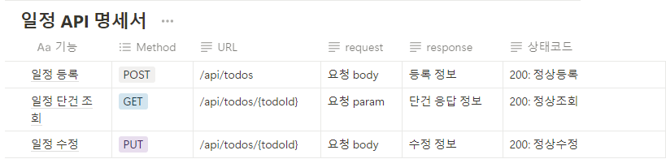
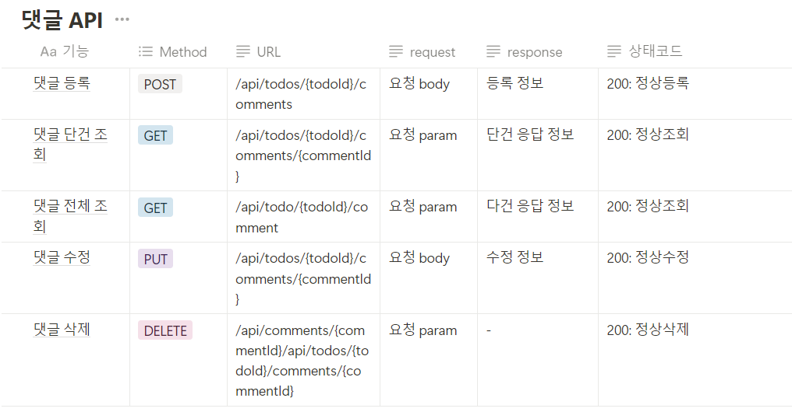

# API 명세서

## 일정 API



## 댓글 API




## ERD 작성
```plaintext
Todo
---------
ID (PK)
Username
Title
Content
CreatedDate
ModifiedDate

Comment
---------
ID (PK)
TodoID (FK to Todo)
Username
Content
CreatedDate
ModifiedDate
